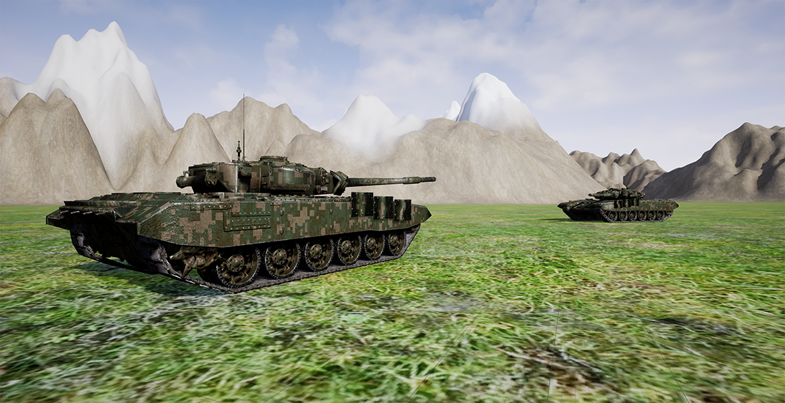

# BattleTank

An open world head-to-head tank fight game with simple AI, terrain, and advanced control system in Unreal Engine 4.

This is my personal implementation of the project with the same name from "The Unreal Engine Developer Course" on Udemy.

**Last completed lecture:** Finalising Your Class Code (66/113)

### Features:
- Main menu with "Start" and "Quit" buttons
- Basic textured landscape sculpted using Unreal
- High quality tank model ([T90 by milosbaskic](https://www.cgtrader.com/free-3d-models/military/vehicle/russian-military-vehicles-t90))
- Basic UI with crosshairs
- Aiming and firing projectiles
- Basic movement functionality for player and AI: forwards/backwards, left/right (NOTE: movement is glitchy at this stage possibly due to the tank collision volumes)
- NavMesh

### Resources:
- Main menu background: [Jumping off Tanks](https://unsplash.com/photos/xO5nNl8QCS4) by Chris Geirman
- Main menu font: [Grunge Tank](https://www.dafont.com/grunge-tank.font)